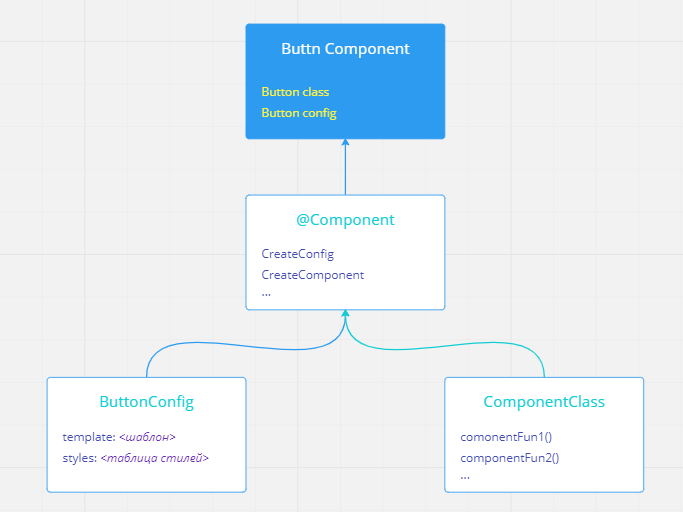
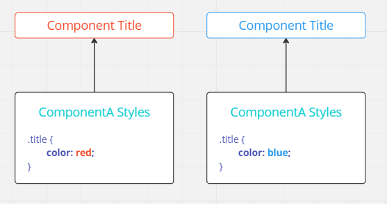
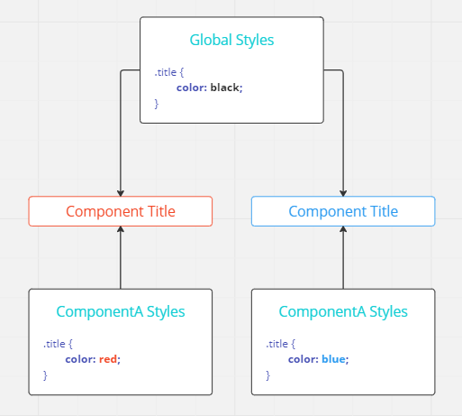
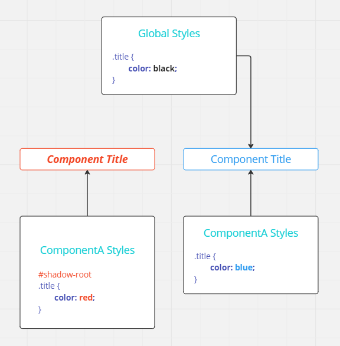
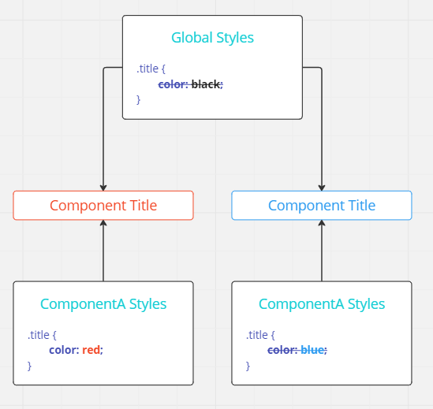
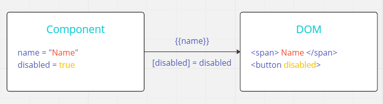
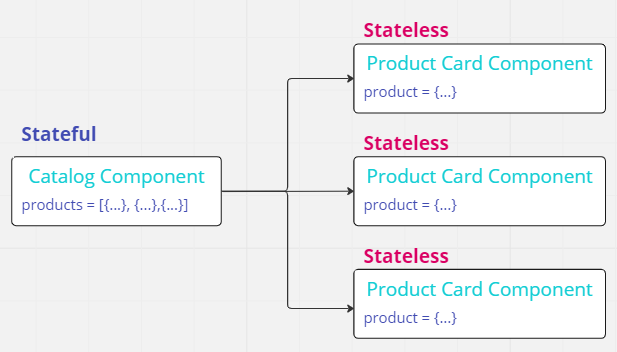
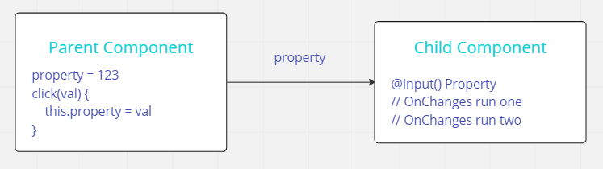

# Создание UI Kit
1. [Компоненты в Angular](#component)
2. [Синтаксис Angular шаблонов](#syntax)
3. [Передача данных дочернему компоненту](#input)
4. Обработка DOM событий
5. Стилилизация Angular компонентов
6. Карточка товара

## <a name="component">Компоненты в Angular</a>

Доброго времени суток!

Сегодня мы научимся конфигурировать компоненты, использовать шаблоны, организуем передачу данных, разберёмся как обрабатывать DOM-события и как управлять стилизацией с помощью атрибутных директив.

Начнем с конфигурации компонентов. Когда мы говорим о компоненте в Angulare в первую очередь мы подразумеваем TypeScript-файл. Именно он является входной точкой компонента и содержит все необходимое для запуска.

```ts
import { Component } from '@angular/core';

@Component({
    selector: 'app-root',
    templateUrl: './app.component.html',
    styleUrls: ['./app.component.less']
})
export class AppComponent {
    // В этих фигурных скобках
    // будет содержаться логика
}
```

Давайте разберёмся из чего он состоит. Код компонента можно разделить на три составляющие:
1. декоратор `@Component()`. Функция обертка отвечающая за конфигурацию создания компонентов.
2. class - содержит бизнес логику.
3. метаданные передающие декоратору конфигурации.



Декоратор  это та сущность которая превращает класс в компонент Angular'а. На вход декоратор получает сам класс компонента, метаданные конфигурации компонента. Более подробно про декоратор можно прочитать [тут](https://www.typescriptlang.org/docs/handbook/decorators.html).

Разберём опции которые будут нам полезны в ближайшее время.

```ts
@Component({
    selector: 'app-root',
    templateUrl: './app.component.html',
    styleUrls: ['./app.component.less'],
    encapsulation: ViewEncapsulation.ShadowDom
})
```

* `selector` - обозначение компонента в HTML.
* `templateUrl` - указывает на расположение файла содержащий шаблон.
* `styleUrls` - указывает на расположение файла содержащее описание стилей.
* `encapsulation` - отвечает за область видимостей CSS-стилей.

`Selector` - это строка в начале которого идет общее для приложения префикс, по умолчанию это `app`, а далее название компонента в формате [kebab-case](https://techrocks.ru/2018/08/09/most-common-programming-case-types/), где новые слова отделяются дефисом. Изначально селектор совпадает с именем компонента которое вы указали при генерации, но вы всегда сможете безопасно изменить его после создания и он не обязан быть схож с именем класса.

`TemplateUrl` и `styleUrl` их предназначения кажутся очевидными, но они имеют определенные особенности. Давайте рассмотрим их.
```ts
@Component({
    selector: 'app-button',
    template: `<button class='button_blue'>Click</button>`,
    styles: [`.button_blue{color: blue}`],
    encapsulation: ViewEncapsulation.Emulated
})
```
В реальной разработке шаблоны компонентов часто выходят компактными, например при создании кнопки. Тоже самое касается и стилей. В таком случае разумнее все разместить в коде компонента и избавиться от двух файлов разом. Помимо прочего не придется переключаться между файлами во время разработки. Используйте свойства `template` и `styles` когда это возможно. Однако стоит проговорить одну особенность. При таком подходе возможно применить только чистый `CSS`.

Следующее свойство – это инкапсуляция отвечающая за область видимости CSS-стилей. Инкапсуляция бывает трех видов:
1. `Emulated` (по умолчанию) - изолирует стили компонентов друг от друга;
2. `ShadowDom` - изолирует стили компонентов используя [shadow DOM](https://learn.javascript.ru/shadow-dom)(теневой DOM);
3. `None` - не изолирует стили и делает их глобальными.



При `emulated` инкапсуляции стили компонентов изолированны друг от друга. Это удобно, но в то же время было бы эффективно глобальные стили приложения общие для всех. К примеру объявление гарнитуры шрифта или CSS-переменные содержащие цвета. `Emulated` инкапсуляция позволяет учитывать глобальные стили, но в то же время устанавливает приоритеты.



Если объявит класс title в глобальных стилях, то он перезапишет стиль для обеих компонентов. Поэтому важно следить чтобы частные классы в глобальных стилях компонента не пересекались.
Если для нас важно сделать стили компонента изолированными от глобальных, то на помощь приходит вид инкапсуляции `ShadowDOM`. 



В этом случае Angular поместит стили в теневое DOM-дерево и компонент перестанет реагировать на глобальные стили. Этот вариант хорошо подходит если вы планируете применять компонент в разных проектах, т.к. он должен быть всегда одинаковым. К примеру – библиотека.

Бывают случаи когда нам перестает быть выгодным изолировать стили. Например при использовании библиотек для работы с векторной графикой. Графика отрисовывается после инициализации стилей и поэтому не выглядит как ожидалось. Для этого существует два варианта решения - вынести стили в глобальный или отключить инкапсуляцию. Однако стоит учитывать, что при отключении инкапсуляции стили компонента станут глобальными и могут влиять на остальные компоненты.



Чтобы такого не случилось существует техника именования классов к примеру [БЭМ](https://ru.bem.info/).
Декоратор компонента может принимать много различных опций которые позволяют гибко настраивать компонент, но их мы разберем позже.

На последок предлагаю разобрать как можно автоматизировать создание компонентов с нужными опциями чтобы не менять их в ручную. С этим нам поможет утилита Angular CLI. В качестве примера приведу 5 часто используемых опций применяемых при создании компонента. Все остальные опции можно найти в [документации](https://angular.io/cli/generate#component-command). 

| Опция                | Описание                                        | Команда на CLI                      |
|----------------------|-------------------------------------------------|-------------------------------------|
| --inline-style       | Сгенерирует компонент со встроенными стилями    | `ng g c --inline-style`             |
| --inline-template    | Сгенерирует компонент со встроенными шаблоном   | `ng g c --inline-template`          |
| --selector           | Сгенерирует компонент с указанным селектором    | `ng g c --selector custom-selector` |
| --prefix             | Сгенерирует компонент с указанным префиксом     | `ng g c --prefix custom-prefix`     |
| --view-encapsulation | Сгенерирует компонент с указанной инкапсуляцией | `ng g c --v=Emulated`               |


## <a name="syntax">Синтаксис Angular шаблонов</a>

В этой части мы поговорим о том как выводить данные в шаблон. Для начала вспомним каким образом решалась задача по выводу данных в DOM при использовании js без применения каких-либо сторонних решений.

```html
<div id="name-element"></div>
```
```js
const name = "My name";
const nameElement = document.getElementById('name-element');

nameElement.innerHTML = name;
```
Сперва нужно было получить ссылку на `div` элемент. В нашем примере это приисходит через индификатор. После этого передаем строку используя `innerHTML`. Если бы эти данные были динамическими, то мы бы создали функцию для того чтобы обработать данный сценарий.

```html
<div id="name-element"></div>
```
```js
const nameElement = document.getElementById('name-element');

function updateData(data, element) {
    element.innerHTML = data;
}
```

Такой подход вполне эффективен при работе с небольшими шаблонами, но в других случаях создаёт сложности. Приходится следить за разными нюансами. Например необходимо проверять, что данные приведены к строке, а элемент соответствует HTML разметке. Angular упращает эти задачи при помощи при помощи механизма привязки данных([data binding](https://angular.io/guide/binding-syntax)). 


Это помогает решать задачи шаблонизации декларативно и безопасно. При рендеринге шаблонов фреймворк определяет места вывода данных за счет специального синтаксиса и выполняет его.
По данной [ссылке](https://stackblitz.com/edit/angular-ivy-cfrtcw?file=src/app/app.component.ts) вы можете познакомиться с реализацией схемы изображенной выше.

```html

<span>{{ title }}</span>
```
```ts
export class CardComponent {
    title = 'Product Name';
    picture = 'https://server.io/picture.png';
}
```
При выводе данных в HTML используются фигурные скобки(`{{ title }}`), а для привязки аттрибутов - квадратный(`[attrName]`). Механизм вывода данных используя фигурные скобки называется - интерполяцией. В этом случае Angular приводит данные к строке и выводит в HTML. При изменении запускается механизм отслеживания и вывод данных обновится без какого-либо вмешательства с нашей стороны.


```html
<div>{{ title }}</div>
<div>{{ price }}</div>
<div>{{ count }}</div>
```


```ts
title = 'Product name';
_price = 100;
count = 2;
get price() {
    return this._price * 2;
}
```
Помимо вывода статических данных интерполяция позволяет выполнять некоторые операции или даже выводить результаты выполнения методов компонента. Но эти дополнительны евозможности стоит использовать в крайних случаях поскольку можно получить просадку в производительности. Более правильно для таких операций применять оператор `get` появившийся в стандарте ES6 или обрабатывать данные заранее другим способом.

Следующий синтаксис позволяет привязать аттрибуты.
```html

```
```ts
picture = 'https://server.io/picture.png'
```
В квадратные скобки заключается имя привязываемого аттрибута, а в значении указывается свойство, но уже без фигурных скобок интерполяции.

```html
 // .../image.png
 // .../default.png
<button [disabled]="isDisabled"></button>// false
```
```ts
image = '.../image.png';
image2 = null;
noImg = '.../default.png';
isDisabled = false;
```

Синтаксис с квадратными скобками обладает с теми же возможностями, что и интерполяция. Можно выводить свойств напрямую и испоьзовать функциональные логические выражения. Советы по оптимизации точно такие же, что при интерполяции.

Часто появляется необходимость обратиться к конкретному HTML-элементу или Angular-компоненту в шаблоне. Для этого существует синтаксис под названием "шаблонная ссылка" или [Template Reference](https://www.tektutorialshub.com/angular/template-reference-variable-in-angular/). Она может быть похожа на селектор `id` из-за символа `#` но ни как с ним не свзан.
```html

<div #box>hello world</div>
<product-card #card></product-card>
```

```html
{{ img.src }} // image.png
{{ box.innerHTML }}  // 'hello world'
{{ card.title }} // product title
```


По шаблонной ссылке мы можем получить доступ к компоненту в коде компонента или даже в шаблоне, где тут же можно вывести каое-либо свойство. К чтению элемента по ссылке из кода компонента мы ещё придём в будущих уроках и будем использовать такой подход весьма часто.

Шаблоны в Angular одна из [киллер-фич](https://kogio.ru/knowledge/killer-feature/) и их возможности практически безграничны. Биндинг данных и атрибутов - это одни из немногих возможностей при работе с шаблонами. 

## <a name="input">Передача данных дочернему компоненту</a>

Компоненты не были бы столь эффективным решением если бы не из способность обмениваться данными друг с другом. Давайте научимся делать это. 

Для начала будет не лишним рассмотреть компоненты с точки зрения работы с данными. Можно выделить два вида компонентов - это `stateful` и `stateless`.


| Состояние   | Описание                                  |
|-------------|-------------------------------------------|
| `stateful`  | Компонент хранит в себе состояние         |
| `stateless` | Компонент получает и отображает состояние |


`Stateful` - хранят в себе данные или состояние, а `stateless` принимают данные из вне и выводят их на экран. 

Давайте представим страницу каталога содержащую список товаров. Информация каждого товара содержится в отдельной карточке. В итоге мы имеет компонет каталога где содержатся данные товаров и эти данные будут передаваться карточкам товаров. Если это изобразить схематично разделив компоненты на `stateful` и `stateless`, то схема будет иметь следующий вид:



Каким же образом передать данные из каталога в карточку? Для этого в `Angular'е` предусмотрен декоратор `@Input()`. Он декарирует свойства наделяя способностью получать данные от родительского компонента.

#### Родительский компонент
`catalog.component.html`:
```html
<app-product-card [product]="product"></app-product-card>
```
`catalog.component.ts`:
```ts
product = {
    title: 'New Project',
    image: '/product-image.jpg',
    price: 100,
    available: 2
}
```

Передача данных происходит в шаблоне и для этого используется два разных синтаксиса. Первый это с квадратными скобками `[]` как при привязке атрибута. Его мы используем когда передаем переменную.

```html
<app-product-card [product]="'New Project'"></app-product-card>
```
Если мы хотим передать строку, то в принципе мы можем оставить синтаксис с кывадратными скобками, но тогда нам придется добавить пару лишних каычек. Чтобы этого не делать можно просто не применять квадратные скобки:

```html
<app-product-card product="New Project"></app-product-card>
```

Теперь, когда мы уже умеем передавать данные между компонентами, давайте рассмотрим ситуации когда нам необходимо реагировать на смену данных.

К примеру модель в каталоге и модель в карточке по каким-то причинам не совпадают и требуют доработки или данные задерживаются. В таких случаях необходимо отображать `loader`. Для этого можно использовать хук `OnChanges()`. Компоненты имеют [жизненный цикл](https://angular.io/guide/lifecycle-hooks) - это определенный события которые происходят в компоненте в зависимости от его сотояния. Например инициализация, изменение входных данных или отключение. С одним из хуков мы могли уже встретить - это `ngOnInit`, т.к. данный хук добавляется по умолчанию при создании компонента. Этот хук вызывается всего один раз в момент инициализации компонента. Хук OnChanges может быть вызван много раз и происходит это при смене входных параметров. Входные параметы помечаются декоратором `@Input()` как в этом примере:

Родительский компонент(Parent Component) имеет свойство `property` и передает её дочернему компоненту(Child Component). Хук OnChanges срабатывает первый раз. Затем происходит "клик" в родительском компоненте и `property` принимает новое значение, дочерний компонент получает его и хук onChanges срабатывает второй раз.

```ts
@Input()
product;

ngOnChanges(changes: SimpleChanges) {
    changes.product.previousValue
    changes.product.currentValue
    changes.product.firstChange
}
```

Хук `OnChanges` может принимать аргумент с интерфесом `SimpleChanges` которое содержит следующие свойства:
1. `previousValue` - предыдущее значение;
2. `currentValue` - текущее значение;
3. `firstChange` - Является изменение первым.

При использовании хука `OnChanges` стоит учитывать некоторые особенности. Бывают ситуации когда передаваемы свойства ещё не инициализированы в родительском компоненте. Дочерний компонент все равно получит данное свойство и значение будет `undefined`. Такую ситуацию легко обработать с помощью оператора `if`.

```ts
@Input()
product;

@Input()
status;

ngOnChanges(changes: SimpleChanges) {
    if (changes.product.currentValue){
        ...
    }
    if (changes.status.currentValue){
    ...
    }
}
```
Если у нас всего одно входное свойство, то можно ограничиться проверкой значения передаваемого свойства.
```ts
@Input()
product;

ngOnChanges(changes: SimpleChanges) {
    if (changes.product){
        ...
    }
}
```

Давайте тепреь обсудим как обрабатывать входные данные. Ни в коем случае нельзя изменять само значение входного параметра, т.к. он синхронизирован между двумя компонентами. Если мы поменяем его значение в дочернем компоненте, то мы повлияем на ешо значение в родительском компоненте. Вместо этого стоит присваивать измененные значения новому свойству.
```ts
@Input()
product;

ngOnChanges(changes: SimpleChanges) {
    if (changes.product){
        this.NewProduct = this.createProduct(this.product);
    }
}
```
Но на самом деле мы можем не сохранять входные данные в компоненте и даже обойтись без хука `onChanges`. Для этого можно воспользоваться оператор `set` появившемся в спецификации ES6. Делается это следующим образом:
```ts
export class CardComponent {
    @Input() set product(val) {
        this.newProduct = this.createProduct(val);
    }
}
```
Этот способ позволяет избежать объявления лишних свойств и имплементации хука `onChanges`.

Данный раздел хотелось бы завершить тем, что использование декоратора `@Input()` не единственный способ организовать обмен данными между компонентами. Но данный способ является простым и весьма популярным.
