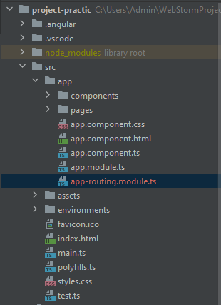
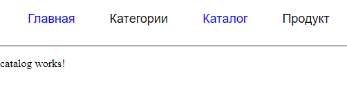

# Маршрутизация
1. [Как устроен роутинг в Angular](#routing)
2. [Как создавать динамические роутеры и считывать параметры](#Structural)
3. [Предзагрузка модулей](#ngIf)
4. [Управление роутером при помощи Guards](#ngFor)


В этом модуле мы поговорим как организовать навигацию внутри Angular приложения. Сначала мы разберёмся как и где зарегистрировать роут в приложении, потом научимся назначать и считывать параметры и на основании их создавать динамические роуты,
после разберёмся как повысить эффективность приложения за счёт ленивых предзагрузок модулей и на последок разберёмся как разграничивать права доступа к роутам.

## <a name="routing">Как устроен роутинг в Angular</a>
Давайте разберёмся что такое роутинг.

Роутинг - это процес назначения обработчика для запрашиваемой страницы.

В качестве примера представим классическиё сайт на WordPress. При обращении к странице каталог WordPress обратится к нужному HTML-шаблону, получит от него необходимые данные, произойдёт рендеринг и у пользователя появится страница в браузере.
Однако когда мы разрабатываем приложение на Angular как и любой другой SPA, то мы имеем дело только с его клиентской частью, т.е. у нас имеется всего одна HTML-страница, а всё остальное действие выполняет JS. Как мы помним Angular приложение состоит из компонентов поэтому когда у нас меняются роуты, то мы сменяем отображаемый компонент на экране пользователя.

Давайте научимся это делать. Скачайте приложение для практики. Данное приложение представляет собой заготовку где созданы некоторые компоненты. В папке `pages` содержатся компоненты страниц приложения. Именно эти компоненты будут использоваться для роутинга.

Обычно организация роутов происходит в route-модулях. Сгенерируем роутин-модуль файл с помощью Angular CLI:
`ng g m app-routing --flat`. В итоге мы имеем следующий вид структуры файлов:



[//]: # (В данный момент `app-routing.module.ts` представляет собой стандарный модуль. Для работы маршрутизации ключевым является модуль `RouterModule` , который располагается в пакете `@angular/router`.)
В `app-routing.module.ts` необходимо указать компоненты(страницы) для роутов. Для этого объявим переменную `routes` типа `Routes`. Тип `Routes` представляет собой массив типов `Route`. `Route` является интерфейсом который содержит в себе параметры. Нам понадобятся: `path` указывающий путь соответствия какому-либо компоненту и `component` - указывает какой компонент будет показываться при переходе на соответствующий роут.
Внесём необходимые строки кода в `app-routing.module.ts`.

```ts
import { NgModule } from '@angular/core';
import { CommonModule } from '@angular/common';
import { Routes } from '@angular/router';
import { HomepageComponent } from './pages/homepage/homepage.component';
import { CategoryComponent } from './pages/category/category.component';
import { CatalogComponent } from './pages/catalog/catalog.component';
import { ProductsComponent } from './pages/products/products.component';

export const routes: Routes = [
    {
        path: '',
        component: HomepageComponent,
    },
    {
        path: 'category',
        component: CategoryComponent,
    },
    {
        path: 'catalog',
        component: CatalogComponent,
    },
    {
        path: 'products',
        component: ProductsComponent,
    },
];

@NgModule({
    declarations: [],
    imports: [CommonModule],
})
export class AppRoutingModule {}
```

С обозначением роутев мы разобрались. Теперь необходимо зарегистрировать роуты. Для этого необходим `RouterModule`. Данный модуль является ключевым для работы маршрутизации.
Для регистрации роутов необходимо вызвать метод `forRoot()` и в качестве аргумента передать ему массив `routes`.

```ts
import { NgModule } from '@angular/core';
import { CommonModule } from '@angular/common';
import { RouterModule, Routes } from '@angular/router';
import { HomepageComponent } from './pages/homepage/homepage.component';
import { CategoryComponent } from './pages/category/category.component';
import { CatalogComponent } from './pages/catalog/catalog.component';
import { ProductsComponent } from './pages/products/products.component';

export const routes: Routes = [
    {
        path: '',
        component: HomepageComponent,
    },
    {
        path: 'category',
        component: CategoryComponent,
    },
    {
        path: 'catalog',
        component: CatalogComponent,
    },
    {
        path: 'products',
        component: ProductsComponent,
    },
];

@NgModule({
    declarations: [],
    imports: [CommonModule, RouterModule.forRoot(routes)],
})
export class AppRoutingModule {}
```

На этом настройку маршрутизации мы завершили. необходимо проверить, что `AppRoutingModule` импортирует в корневой `AppModule`.

```ts
import { NgModule } from '@angular/core';
import { BrowserModule } from '@angular/platform-browser';

import { AppComponent } from './app.component';
import { TopBarModule } from './components/top-bar/top-bar.module';
import { AppRoutingModule } from './app-routing.module';

@NgModule({
    declarations: [AppComponent],
    imports: [BrowserModule, TopBarModule, AppRoutingModule],
    providers: [],
    bootstrap: [AppComponent],
})
export class AppModule {}

```

Теперь мы можем проверить работу наших роутов. Для этого в строке браузера достаточно ввести `http://localhost:4200/catalog`. В случае отсутствия роута `catalog` браузер перекинул бы нас на `http://localhost:4200`.
Для того чтобы увидеть содержимое компонента страницы роутинга необходимо добавить `router-outlen` в `app.component.html`.

```html
<app-top-bar></app-top-bar>

<router-outlet></router-outlet>
```

Теперь у нас отображаются компоненты маршрутизации. Проверьте это введя `http://localhost:4200/catalog`.

Научимся назначать ссылкам соответствующий роут. Для этого перейдем в компонент верхнего навигационного меню ( `top-bar.component.ts` ).
Присвоим атрибуту `href` тега `a` наши роуты и проверим работу навигационного меню. 

Содержимое `top-bar.component.ts`:
```ts
import { Component, OnInit } from '@angular/core';
import { FlatButtonEnum } from '../flat-button/enums';

@Component({
    selector: 'app-top-bar',
    template: `
        <header class="top-bar">
            <div class="container">
                <ul>
                    <li>
                        <a href="/">Главная</a>
                    </li>
                    <li>
                        <a href="/category">Категории</a>
                    </li>
                    <li>
                        <a href="/catalog">Каталог</a>
                    </li>
                    <li>
                        <a href="/products">Продукт</a>
                    </li>
                </ul>
            </div>

            <div class="flex">
                <app-flat-button
                    [icon]="FlatButtonEnum.Favorite"
                ></app-flat-button>
                <app-flat-button
                    [icon]="FlatButtonEnum.ShoppingBasket"
                ></app-flat-button>
                <a href="">Личный кабинет</a>
            </div>
        </header>
        <hr class="hr-line" />
    `,
    styles: [
        `
            .top-bar {
                display: flex;
                justify-content: space-between;
            }
            .hr-line {
                margin: 10px 0 0 0;
                padding: 0;
                height: 0;
                border: none;
                border-top: 1px solid #333;
            }
            .container {
                font-size: 18px;
            }
            ul {
                display: flex;
                justify-content: space-between;
            }
            li {
                list-style-type: none;
                margin-right: 50px;
            }
            a {
                text-decoration: none;
                color: #000;
            }
            .flex {
                display: flex;
                align-items: center;
            }
        `,
    ],
})
export class TopBarComponent implements OnInit {
    readonly FlatButtonEnum = FlatButtonEnum;
    constructor() {}

    ngOnInit(): void {}
}
```

При проверке навигационного меню мы увидим, что роуты работают. Но при таком назначении роутов можно заметить, что страница полностью перезагружается.
При размещении приложения на сервер это приведёт к тому, что пользователь будет тратить лишний трафик. Для того чтобы избежать это в Angular применяется директива `routerLink`. Эта директива говорит, что Angular нужно перехватить навигацию и совершить роутинг используя свою библиотеку `@angular/router`.

Содержимое `top-bar.component.ts`:
```ts
import { Component, OnInit } from '@angular/core';
import { FlatButtonEnum } from '../flat-button/enums';

@Component({
    selector: 'app-top-bar',
    template: `
        <header class="top-bar">
            <div class="container">
                <ul>
                    <li>
                        <a routerLink="/">Главная</a>
                    </li>
                    <li>
                        <a routerLink="/category">Категории</a>
                    </li>
                    <li>
                        <a routerLink="/catalog">Каталог</a>
                    </li>
                    <li>
                        <a routerLink="/products">Продукт</a>
                    </li>
                </ul>
            </div>

            <div class="flex">
                <app-flat-button
                    [icon]="FlatButtonEnum.Favorite"
                ></app-flat-button>
                <app-flat-button
                    [icon]="FlatButtonEnum.ShoppingBasket"
                ></app-flat-button>
                <a href="">Личный кабинет</a>
            </div>
        </header>
        <hr class="hr-line" />
    `,
    styles: [
        `
            .top-bar {
                display: flex;
                justify-content: space-between;
            }
            .hr-line {
                margin: 10px 0 0 0;
                padding: 0;
                height: 0;
                border: none;
                border-top: 1px solid #333;
            }
            .container {
                font-size: 18px;
            }
            ul {
                display: flex;
                justify-content: space-between;
            }
            li {
                list-style-type: none;
                margin-right: 50px;
            }
            a {
                text-decoration: none;
                color: #000;
            }
            .flex {
                display: flex;
                align-items: center;
            }
        `,
    ],
})
export class TopBarComponent implements OnInit {
    readonly FlatButtonEnum = FlatButtonEnum;
    constructor() {}

    ngOnInit(): void {}
}

```

теперь при переключении навигации не происходит полное обновление страницы. Директива `routerLink` перехватывает навигацию, отменяет поведение браузера по умолчанию и выполняет роутинг используя свои инструменты. Таким образом роутинг получается плавным, приложение не перезагружается, не теряем глобальное состояние и получаем прирост эффективности.

Мы научились организовывать навигацию. Давайте научимся присваивать класс активности для навигации.
Для этого в Angular существует директива `routerLinkActive`. Данная директива будет сравнивать адрес который указан в
`routerLink` и если этот адрес будет совпадать с текущим, то она будет назначать класс `active`. Применим новые знания к нашему проекту.

Содержимое `top-bar.component.ts`:
```ts
import { Component, OnInit } from '@angular/core';
import { FlatButtonEnum } from '../flat-button/enums';

@Component({
    selector: 'app-top-bar',
    template: `
        <header class="top-bar">
            <div class="container">
                <ul>
                    <li>
                        <a routerLink="/" routerLinkActive="active">Главная</a>
                    </li>
                    <li>
                        <a routerLink="/category" routerLinkActive="active"
                            >Категории</a
                        >
                    </li>
                    <li>
                        <a routerLink="/catalog" routerLinkActive="active"
                            >Каталог</a
                        >
                    </li>
                    <li>
                        <a routerLink="/products" routerLinkActive="active"
                            >Продукт</a
                        >
                    </li>
                </ul>
            </div>

            <div class="flex">
                <app-flat-button
                    [icon]="FlatButtonEnum.Favorite"
                ></app-flat-button>
                <app-flat-button
                    [icon]="FlatButtonEnum.ShoppingBasket"
                ></app-flat-button>
                <a href="">Личный кабинет</a>
            </div>
        </header>
        <hr class="hr-line" />
    `,
    styles: [
        `
            .top-bar {
                display: flex;
                justify-content: space-between;
            }
            .hr-line {
                margin: 10px 0 0 0;
                padding: 0;
                height: 0;
                border: none;
                border-top: 1px solid #333;
            }
            .container {
                font-size: 18px;
            }
            ul {
                display: flex;
                justify-content: space-between;
            }
            li {
                list-style-type: none;
                margin-right: 50px;
            }
            a {
                text-decoration: none;
                color: #000;
            }
            .flex {
                display: flex;
                align-items: center;
            }
            .active {
                color: blue;
            }
        `,
    ],
})
export class TopBarComponent implements OnInit {
    readonly FlatButtonEnum = FlatButtonEnum;
    constructor() {}

    ngOnInit(): void {}
}


```

В итоге наш результат имеет следующий вид:



На изображении нас смущает тот факт, что главная страница всегда активна. Давайте разберёмся как это можно исправить. Если мы заглянем в файл роутинга, то можем заметить, что `path` у главной страницы пуст. Это значит, что данная страница может являться частью любого пути в файле `app-routing.module.ts`. 

Фрагмент файла `app-routing.module.ts`:
```ts
...
    {
        path: '',
        component: HomepageComponent,
    }, 
...
```

Для того чтобы избежать это в Angular применяется директива `routerLinkActiveOptions`. данная директива принимает объект в котором мы передаем параметр `exact: true`. `exact` говорит о том, что страница будет подсвечиваться активностью только если её путь будет полностью совпадать.

Содержимое `top-bar.component.ts`:

```ts
import { Component, OnInit } from '@angular/core';
import { FlatButtonEnum } from '../flat-button/enums';

@Component({
    selector: 'app-top-bar',
    template: `
        <header class="top-bar">
            <div class="container">
                <ul>
                    <li>
                        <a
                            routerLink="/"
                            routerLinkActive="active"
                            [routerLinkActiveOptions]="{ exact: true }"
                            >Главная</a
                        >
                    </li>
                    <li>
                        <a routerLink="/category" routerLinkActive="active"
                            >Категории</a
                        >
                    </li>
                    <li>
                        <a routerLink="/catalog" routerLinkActive="active"
                            >Каталог</a
                        >
                    </li>
                    <li>
                        <a routerLink="/products" routerLinkActive="active"
                            >Продукт</a
                        >
                    </li>
                </ul>
            </div>

            <div class="flex">
                <app-flat-button
                    [icon]="FlatButtonEnum.Favorite"
                ></app-flat-button>
                <app-flat-button
                    [icon]="FlatButtonEnum.ShoppingBasket"
                ></app-flat-button>
                <a href="">Личный кабинет</a>
            </div>
        </header>
        <hr class="hr-line" />
    `,
    styles: [
        `
            .top-bar {
                display: flex;
                justify-content: space-between;
            }
            .hr-line {
                margin: 10px 0 0 0;
                padding: 0;
                height: 0;
                border: none;
                border-top: 1px solid #333;
            }
            .container {
                font-size: 18px;
            }
            ul {
                display: flex;
                justify-content: space-between;
            }
            li {
                list-style-type: none;
                margin-right: 50px;
            }
            a {
                text-decoration: none;
                color: #000;
            }
            .flex {
                display: flex;
                align-items: center;
            }
            .active {
                color: blue;
            }
        `,
    ],
})
export class TopBarComponent implements OnInit {
    readonly FlatButtonEnum = FlatButtonEnum;
    constructor() {}

    ngOnInit(): void {}
}

```

После этого проблем с активностью навигационного меню пропала.

Помимо совершения переходов по ссылкам из шаблона, Angular позволяет это делать програмно. Для этого выполним следующие действия.
Откроем файл `top-bar.component.ts` и добавим обработку `click`. Обработчик назовём `openRoute`, а в  качестве аргумента будем передавать имя роута на который хотим перейти.
Для избранного - это `favorite`, а для корзины - `cart`. 

Теперь необходимо настроить сам обработчик. Чтобы совершать роут програмно необходимо получить доступ к роуту. Для этого заинжектируем в метод конструктора `Router`.


Содержимое `top-bar.component.ts`:

```ts
import { Component, OnInit } from '@angular/core';
import { FlatButtonEnum } from '../flat-button/enums';
import { Router } from '@angular/router';

@Component({
    selector: 'app-top-bar',
    template: `
        <header class="top-bar">
            <div class="container">
                <ul>
                    <li>
                        <a
                            routerLink="/"
                            routerLinkActive="active"
                            [routerLinkActiveOptions]="{ exact: true }"
                            >Главная</a
                        >
                    </li>
                    <li>
                        <a routerLink="/category" routerLinkActive="active"
                            >Категории</a
                        >
                    </li>
                    <li>
                        <a routerLink="/catalog" routerLinkActive="active"
                            >Каталог</a
                        >
                    </li>
                    <li>
                        <a routerLink="/products" routerLinkActive="active"
                            >Продукт</a
                        >
                    </li>
                </ul>
            </div>

            <div class="flex">
                <app-flat-button
                    [icon]="FlatButtonEnum.Favorite"
                    text="Избранное"
                    (click)="openRoute('favorites')"
                ></app-flat-button>
                <app-flat-button
                    text="Корзина"
                    [icon]="FlatButtonEnum.ShoppingBasket"
                    (click)="openRoute('cart')"
                ></app-flat-button>
                <a href="">Личный кабинет</a>
            </div>
        </header>
        <hr class="hr-line" />
    `,
    styles: [
        `
            .top-bar {
                display: flex;
                justify-content: space-between;
            }
            .hr-line {
                margin: 10px 0 0 0;
                padding: 0;
                height: 0;
                border: none;
                border-top: 1px solid #333;
            }
            .container {
                font-size: 18px;
            }
            ul {
                display: flex;
                justify-content: space-between;
            }
            li {
                list-style-type: none;
                margin-right: 50px;
            }
            a {
                text-decoration: none;
                color: #000;
            }
            .flex {
                display: flex;
                align-items: center;
            }
            .active {
                color: blue;
            }
        `,
    ],
})
export class TopBarComponent implements OnInit {
    readonly FlatButtonEnum = FlatButtonEnum;
    constructor(private router: Router) {}

    ngOnInit(): void {}

    openRoute(path: string) {
        this.router.navigate(['/', path]);
    }
}

```

Помимо метода `navigate()` существует ещё `navigateByUrl()`. `navigateByUrl()` принимает строку и указывает абсолютный путь.

```ts
openRoute(path: string) {
    this.router.navigateByUrl(`/${route}`);
}
```

Теперь мы умеем настраивать роуты програмно. Давайте ещё обработаем некоторые частные ситуации.
Например мы не хотим отображать главную страницу, а хотим перенаправить на какую-либо иную страницу.
Для этого в `Routes` имеется `redirectTo`. 

Содержимое `app-routing.module.ts`:

```ts
export const routes: Routes = [
    {
        path: '',
        redirectTo: 'category',
    },
    {
        path: 'category',
        component: CategoryComponent,
    },
    {
        path: 'catalog',
        component: CatalogComponent,
    },
    {
        path: 'products',
        component: ProductsComponent,
    },
    {
        path: 'favorites',
        component: FavoritesComponent,
    },
    {
        path: 'cart',
        component: CartComponent,
    },
];
```

Но при такой конфигурации в консоли будет ошибка, т.к. "" относится ко всем. В таком случае: 

```ts
export const routes: Routes = [
    {
        path: '',
        redirectTo: 'category',
        pathMatch: 'full'
    },
    {
        path: 'category',
        component: CategoryComponent,
    },
    {
        path: 'catalog',
        component: CatalogComponent,
    },
    {
        path: 'products',
        component: ProductsComponent,
    },
    {
        path: 'favorites',
        component: FavoritesComponent,
    },
    {
        path: 'cart',
        component: CartComponent,
    },
]
```


Бывают ситуации когда мы пытаемся перейти по заведомо ложной странице.
В этом случае необходимо обрабатывать подобные ошибки.

```ts
export const routes: Routes = [
    {
        path: '',
        component: HomepageComponent
    },
    {
        path: 'category',
        component: CategoryComponent,
    },
    {
        path: 'catalog',
        component: CatalogComponent,
    },
    {
        path: 'products',
        component: ProductsComponent,
    },
    {
        path: 'favorites',
        component: FavoritesComponent,
    },
    {
        path: 'cart',
        component: CartComponent,
    },
    {
        path: 'not-found',
        component: NotFoundComponent
    },
    {
        path: '**',
        redirectTo: 'not-found'
    }
];
```

Давайте посмотрим какте ещё бывают экстра-опции. В Angular бывает две стратегии навигации.
С одной стратегией мы уже познакомились, а другая стратегия с [#](https://angular.io/api/common/HashLocationStrategy).
Для того чтобы подключить данную стратегию необходимо в `app-routing.module.ts`:

```ts
@NgModule({
    declarations: [],
    imports: [CommonModule, RouterModule.forRoot(routes)],
    exports: [RouterModule],
    providers: [{ provide: LocationStrategy, useClass: HashLocationStrategy }],
})
```

После данных манипуляций в строке браузера мы увидим `#`. Теперь все маршруты которе строит приложение выстраиваются после решётки.

[//]: # (// для чего это нужно?) 

Помимо выбора стратегии мы можем передать роутеру экстра-параметры. 

Содержимое `app-routing.module.ts`:

```ts
import { NgModule } from '@angular/core';
import {
    CommonModule,
} from '@angular/common';
import { ExtraOptions, RouterModule, Routes } from '@angular/router';
import { HomepageComponent } from './pages/homepage/homepage.component';
import { CategoryComponent } from './pages/category/category.component';
import { CatalogComponent } from './pages/catalog/catalog.component';
import { ProductsComponent } from './pages/products/products.component';
import { FavoritesComponent } from './pages/favorites/favorites.component';
import { CartComponent } from './pages/cart/cart.component';
import { NotFoundComponent } from './pages/not-found/not-found.component';

export const routes: Routes = [
    {
        path: '',
        component: HomepageComponent,
    },
    {
        path: 'category',
        component: CategoryComponent,
    },
    {
        path: 'catalog',
        component: CatalogComponent,
    },
    {
        path: 'products',
        component: ProductsComponent,
    },
    {
        path: 'favorites',
        component: FavoritesComponent,
    },
    {
        path: 'cart',
        component: CartComponent,
    },
    {
        path: 'not-found',
        component: NotFoundComponent,
    },
    {
        path: '**',
        redirectTo: 'not-found',
    },
];

export const options: ExtraOptions = {
    enableTracing: true,
};

@NgModule({
    declarations: [],
    imports: [CommonModule, RouterModule.forRoot(routes, options)],
    exports: [RouterModule],
})
export class AppRoutingModule {}

```

После передачи данных опций в консоли мы можем увидеть действия которые совершает роутер ангуляра.


[//]: # (добавить описание действий роутов.)

В `ExtraOptions` можно передать `scrollPositionRestoration`. Эта опция позволяет исправить дефолтное поведение 
роутера и востанавливает позицию скрола на самый верх при переходах между страницами.


```ts
import { NgModule } from '@angular/core';
import { CommonModule } from '@angular/common';
import { ExtraOptions, RouterModule, Routes } from '@angular/router';
import { HomepageComponent } from './pages/homepage/homepage.component';
import { CategoryComponent } from './pages/category/category.component';
import { CatalogComponent } from './pages/catalog/catalog.component';
import { ProductsComponent } from './pages/products/products.component';
import { FavoritesComponent } from './pages/favorites/favorites.component';
import { CartComponent } from './pages/cart/cart.component';
import { NotFoundComponent } from './pages/not-found/not-found.component';

export const routes: Routes = [
    {
        path: '',
        component: HomepageComponent,
    },
    {
        path: 'category',
        component: CategoryComponent,
    },
    {
        path: 'catalog',
        component: CatalogComponent,
    },
    {
        path: 'products',
        component: ProductsComponent,
    },
    {
        path: 'favorites',
        component: FavoritesComponent,
    },
    {
        path: 'cart',
        component: CartComponent,
    },
    {
        path: 'not-found',
        component: NotFoundComponent,
    },
    {
        path: '**',
        redirectTo: 'not-found',
    },
];

export const options: ExtraOptions = {
    enableTracing: false,
    scrollPositionRestoration: 'enabled',
};

@NgModule({
    declarations: [],
    imports: [CommonModule, RouterModule.forRoot(routes, options)],
    exports: [RouterModule],
})
export class AppRoutingModule {}

```

Дававйте поговорим об `router-outlet`. Этот компонент является точно таким  же компонентом в Ангуляре как и все остальные.
Единственное отличие его шаблоном будет являться та страница которая отображается в результате роутинга.
У этого компонента имеются свои `EventEmiter` события: `activate`, `deactivate`.

```html
<router-outlet
    (activate)="onActivate($event)"
    (deactivate)="onDeactivate($event)"
></router-outlet>
```

```ts
    onActivate(event: any) {
        console.log(event);
    }

    onDeactivate(event: any) {
        console.log(event);
    }
}
```

При событии onActivate указывается компонент на который мы переходим, а onDeactivate - с котого мы пепреходим.

Так же мы можем подписываться на события роутинга.

```ts
constructor(private router: Router) {
        this.router.events.subscribe((event) => {
            if (event instanceof NavigationStart) {
                console.log('navigation start');
            }

            if (event instanceof NavigationEnd) {
                console.log('navigation end');
            }
        });
    }
```

## <a name="Structural">Как создавать динамические роутеры и считывать параметры</a>

Для того чтобы создать динамический роут на основе параметра необходимо:

```ts
{
    path: 'products/:id',
    component: ProductsComponent,
},
```

```ts
    <app-products
        [routerLink]="['/product', product.id]"
        *ngFor="let product of products"
        [product] = "product"
    ></app-products>
```

Для того чтобы считать `id` из строки браузера:

```ts
    productId = '';
    constructor(private route: ActivatedRoute) {
        this.productId = route.snapshot.params['id'];
    }
```

Для того чтобы считать параметры фильтра:

```ts
    constructor(private route: ActivatedRoute) {
        this.sort = this.route.snapshot.queryParams['sort'];
        this.available = this.route.snapshot.queryParams['available'];
    }
```

Назначение параметров в строке браузера (из шаблона):

```html
    <app-products
        *ngFor="let product of products"
        [queryParams]="{name: 'Google Pixel', price: 500}"
        [routerLink]="['/product', product.id]"
        [product] = "product"
    ></app-products>
```
Назначение параметров в строке браузера (програмно):

```html
<section>
    <input type="text" #search>
    <button (click)="setSearch(search.value)">Искать</button>
</section>
```

```ts
    constructor(private router: Router, private route: ActivatedRoute) {}

    setSearch(search: string): void {
        this.router.navigate(['.'], {
            relativeTo: this.route,
            queryParams: { search },
        })
    }
```

Передача произвольных данных с помощью роута. В роутинге произвольные данные передаются через `data`.

```ts
    {
        path: 'catalog',
        component: CatalogComponent,
        data: {title: 'Каталог товаров'}
    },
```

Для считывания передаваемых данных необходимо:

```ts
    constructor(private route: ActivatedRoute) {
        this.title = this.route.snapshot.data.title;
    }
```

Если мы хотим передать данные через роут динамически, то нам необходимо

```ts
openRoute(route: string) {
    this.router.navigate(['/', route],{
        state: {
            data: {title: 'Корзина', count: 10}
        }
    })
}
```

Теперь необходимо получить переданные данные

```ts
state = window.history.state
```

